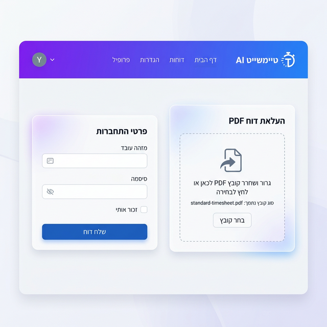
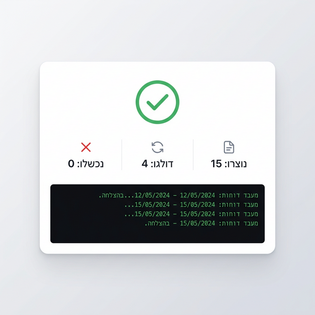

# HRM Portal Timesheet Automation



A Python-based automation system that extracts timesheet data from a PDF and automatically enters it into the HRM portal at hrm-portal.malam-payroll.com.

## ⚠️ Important Security Notice

This automation requires your personal HRM credentials. Please ensure:
- ✅ You have authorization from your employer to use automation
- ✅ Credentials are stored only as environment variables (never committed to git)
- ✅ Use this only on your personal account
- ✅ Review the code before running if you have security concerns

## Features

✨ **Automated Data Entry**
- Extracts timesheet data from PDF
- Automatically enters entry/exit times into HRM portal
- Handles Hebrew text and date formats

🛡️ **Safety First**
- Dry-run mode to preview actions without making changes
- Idempotent (safe to run multiple times - no duplicates)
- Skips weekends and flagged days automatically
- Comprehensive audit reporting with screenshots

🎯 **Smart Handling**
- Detects existing portal values (only updates if different)
- Configurable rules for special cases
- Retry logic for transient errors
- Detailed logging and error reporting

## Prerequisites

- **Python 3.8+** 
- **pip** (Python package manager)
- **HRM portal account** at hrm-portal.malam-payroll.com
- **January 2026 timesheet PDF** (optional - uses mock data if not provided)

## Quick Start (Standalone Desktop App)

The fastest way to use the system — builds a **standalone executable** with Python, Chrome, and all dependencies bundled in. No extra installations needed!

### Build (one time only)

**Mac/Linux:**
```bash
git clone <repository-url>
cd sqlinksrab
chmod +x build.sh
./build.sh
```

**Windows:**
```batch
git clone <repository-url>
cd sqlinksrab
build.bat
```

The build script automatically:
1. ✅ Creates a Python virtual environment and installs dependencies
2. ✅ Downloads an embedded Chrome browser
3. ✅ Packages everything into a standalone executable
4. ✅ Copies Chrome into the final app bundle

### Run

**Mac/Linux:**
```bash
cd dist/HRM_Timesheet_Automation
./HRM_Timesheet_Automation
```

**Windows:**
```batch
cd dist\HRM_Timesheet_Automation
HRM_Timesheet_Automation.exe
```

The web interface opens automatically at **http://localhost:5001**

### Distribute to Others

After building, zip the entire `dist/HRM_Timesheet_Automation` folder and share it. Recipients just extract and double-click — **no installation required!**

---

## Manual Installation (for developers)

```bash
cd sqlinksrab

# Create virtual environment
python -m venv venv

# Activate
# Mac/Linux:
source venv/bin/activate
# Windows:
venv\Scripts\activate

# Install dependencies
pip install -r requirements.txt

# Install browsers
playwright install chromium

# Copy config files
cp config.example.json config.json
cp .env.example .env

# Run the web server
python web_server.py
```

---

## Usage

1. Open **http://localhost:5001** in your browser
2. Upload your timesheet PDF
3. Enter your employee ID and password
4. Click Submit
5. Enter the OTP code when prompted
6. The system fills in your timesheet automatically!



## Configuration

Edit `config.json` to customize behavior:

```json
{
  "portal": {
    "base_url": "https://hrm-portal.malam-payroll.com",
    "timesheet_url": "..."
  },
  "automation": {
    "target_month": "2026-01",
    "dry_run": false,
    "headless": true,
    "timeout_seconds": 30,
    "retry_attempts": 3
  },
  "entry_rules": {
    "skip_weekends": true,
    "skip_missing_entry_exit_flags": true,
    "handle_total_hours_only": "skip_and_flag"
  }
}
```

### Entry Rules

- **skip_weekends**: Automatically skip Fridays and Saturdays (default: `true`)
- **skip_missing_entry_exit_flags**: Skip days with "missing entry/exit" warnings (default: `true`)
- **handle_total_hours_only**: What to do with days that have only total hours, no entry/exit times
  - `"skip_and_flag"`: Skip and mark in report (default)
  - `"enter_total"`: Enter total hours only (if portal supports it)

## Output

After running, you'll find in the `output/` directory:

- **audit_report_YYYYMMDD_HHMMSS.csv**: Detailed log of all actions
- **failure_*.png**: Screenshots of any failures (for debugging)

### Audit Report Fields

| Field | Description |
|-------|-------------|
| timestamp | When the action was attempted |
| date | Timesheet date (YYYY-MM-DD) |
| action | created / updated / skipped / failed |
| start_time | Entry time attempted |
| end_time | Exit time attempted |
| total_hours | Total hours (if applicable) |
| portal_status | Confirmation or error message |
| screenshot_path | Path to failure screenshot |
| notes | Additional context |

### Summary Statistics

The automation prints a summary at the end:

```
============================================================
AUDIT REPORT SUMMARY
============================================================
Total Records:    31
Created:          15
Updated:          2
Skipped:          12
Failed:           2
Success Rate:     54.8%
============================================================
```

## Special Cases Handling

The automation handles several special cases from your January 2026 PDF:

### Weekends
- **Fridays & Saturdays** (שישי/שבת): Automatically skipped
- No entries created for non-working days

### Missing Entry/Exit
- **Jan 29**: "missing entry/exit; will be deducted from vacation"
- Automatically **skipped** and flagged in the report
- You must handle this manually in the portal

### Total Hours Only
- **Jan 1, Jan 7**: Only show "8.40" without entry/exit times
- Default behavior: **skip and flag** for manual decision
- Configurable in `config.json`

## Troubleshooting

### "Config file not found"
- Make sure you copied `config.example.json` to `config.json`
- Check you're running from the `src/` directory

### "Missing credentials"
- Verify you created `.env` file with your credentials
- Check the file is in the project root (not in `src/`)
- Ensure no extra spaces around the `=` sign

### "Login failed"
- Verify your employee ID and password are correct
- Check if the portal requires MFA/captcha (see below)
- Try running with `--headful` to see what's happening

### MFA / Captcha Issues
If the portal uses multi-factor authentication or captcha:
1. Run once in headful mode: `python main.py --headful`
2. Manually complete MFA/captcha when prompted
3. The session will be maintained for subsequent steps

### Portal UI Changed
If selectors no longer work (portal was redesigned):
1. Edit `src/selectors.py` with new CSS selectors
2. Use browser DevTools to find correct selectors
3. Update the relevant selector constants

### "Element not found" Errors
- The portal might have changed its structure
- Run with `--headful` to see what's happening
- Check `src/selectors.py` and update selectors if needed
- Screenshots in `output/` folder can help diagnose issues

### Decimal Hours Format
If times are entered incorrectly, the decimal hours might be interpreted wrong:
- **10.23** could mean:
  - 10 hours and 13.8 minutes (0.23 × 60) - standard
  - 10 hours 23 minutes - special notation

Current interpretation: **standard** (configurable in `config.json`)

## Project Structure

```
sqlinksrab/
├── README.md                    # This file
├── requirements.txt             # Python dependencies
├── config.json                  # Your configuration (create from example)
├── config.example.json          # Configuration template
├── .env                         # Your credentials (create from example)
├── .env.example                 # Credential template
├── .gitignore                   # Git ignore rules
├── src/
│   ├── __init__.py
│   ├── main.py                  # Main orchestrator
│   ├── config.py                # Configuration management
│   ├── pdf_extractor.py         # PDF parsing logic
│   ├── portal_client.py         # Browser automation
│   ├── selectors.py             # UI selector definitions
│   └── reporting.py             # Audit report generation
└── output/
    └── audit_report_*.csv       # Generated reports
```

## Security Best Practices

1. **Credentials**: Never share your `.env` file or commit it to git
2. **Logs**: Audit reports are local only - don't upload unless redacted
3. **Screenshots**: May contain sensitive data - review before sharing
4. **Isolation**: Run on your personal workstation, not shared machines
5. **Review**: Check the audit report before relying on the automation

## Limitations

- **Portal Changes**: May require selector updates if portal UI changes
- **MFA/Captcha**: Requires manual intervention on first run
- **Complex Cases**: Some scenarios may need manual handling
- **Single Month**: Currently configured for January 2026 only

## Future Enhancements

Potential improvements (not yet implemented):

- [ ] Multi-month support
- [ ] Reconciliation mode (compare PDF vs portal)
- [ ] Support for report types / shift codes
- [ ] Automated tests
- [ ] GUI interface
- [ ] Cloud deployment options

## Support

For issues or questions:
1. Check the troubleshooting section above
2. Review the audit report for specific error messages
3. Run with `--headful --dry-run` to see what's happening
4. Check screenshots in `output/` folder

## License

This is a personal automation tool. Use at your own discretion and risk.

Always ensure you have proper authorization before automating interactions with employer systems.
